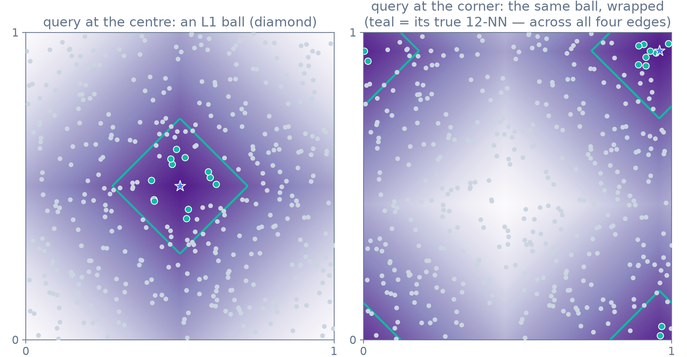
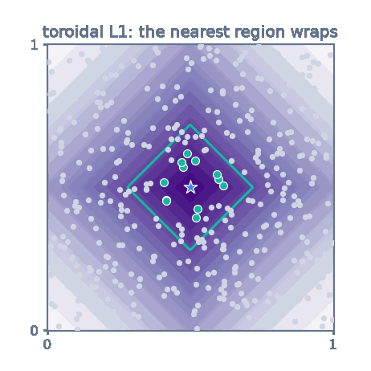
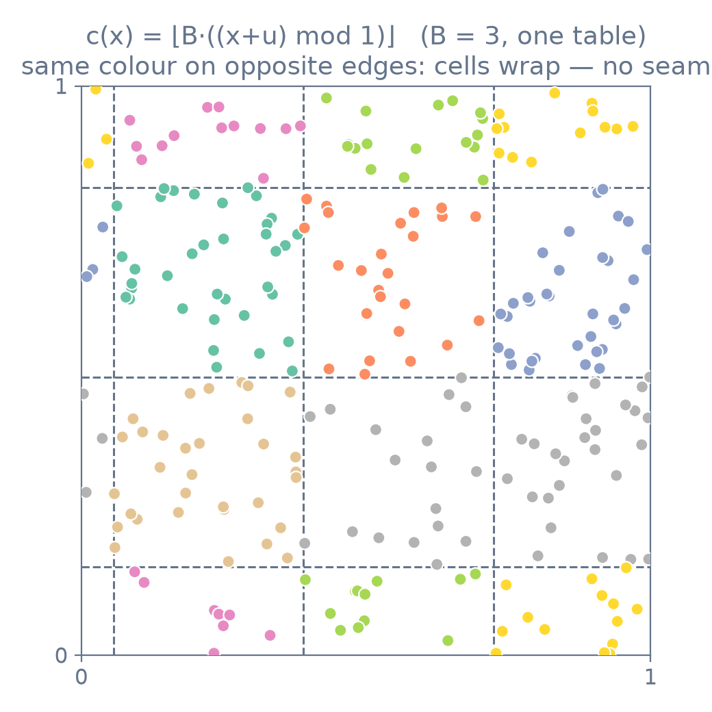
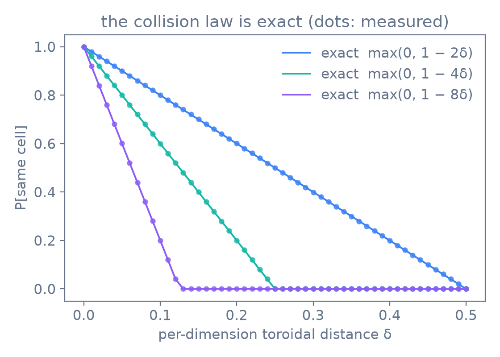
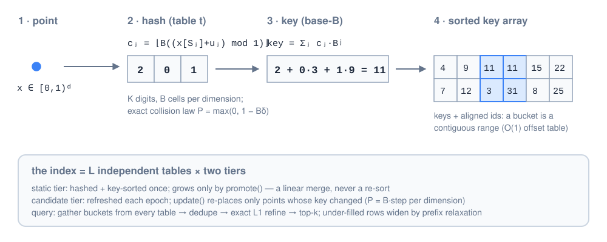
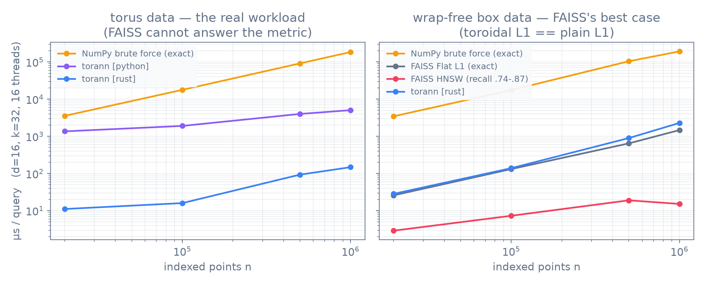
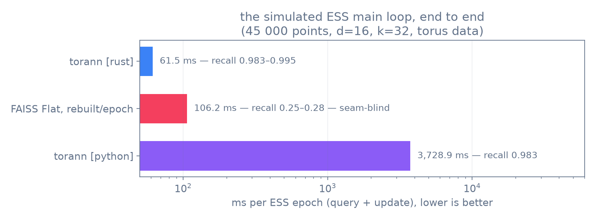

#  torann

## TORoidal Approximate Nearest Neighbours


**torann** is exact + approximate k-NN and range search on the unit torus
$[0,1)^d$ under **toroidal L1** — a metric mainstream ANN libraries do not
offer, chosen deliberately: L1 degrades more gracefully than L2/cosine in
high dimensions, and on the torus the LSH guarantee is *exact*. Built for
[ESS](https://github.com/mariolpantunes/ess)-style epoch workloads: static
anchors, a moving candidate tier, selective updates, batch promotion.

## Features

* **The metric is the contract**: toroidal L1, exact distances everywhere —
  the LSH only filters candidates, never approximates a distance.
* **An LSH family that is exactly L1-sensitive on the torus**: randomly
  rotated integer grids with a closed-form, seam-free collision law
  (see [How it works](#how-it-works)).
* **ESS-shaped lifecycle**: two tiers (anchors + candidates), selective
  `update()` that re-places only points whose hash cell changed,
  `promote()` as a linear merge — never a re-sort, exact after every step.
* **No brute-force fallback**: under-filled queries widen buckets by
  *prefix relaxation* (contiguous sorted-key ranges), so `k` results are
  structurally guaranteed.
* **Self-tuning**: `fit(..., k=...)` or `radius=...` derives the hash
  parameters (B, K, L) from the workload; explicit arguments always win.
* **Three interchangeable implementations** of one interface
  (`torann/base.py`): exact NumPy brute force, a pure-Python LSH
  reference, and a Rust core (PyO3 + rayon) that produces byte-identical
  hash tables at 60–120× the speed. Without the compiled module the
  package still runs, on the reference implementation.

## Installation

### From PyPI

```bash
pip install torann
```

### From source

The project is a maturin mixed Rust/Python package — a [Rust
toolchain](https://rustup.rs) is required to build the native core:

```bash
python3 -m venv venv
source venv/bin/activate
pip install --upgrade pip
pip install .
```

**Requirements:** Python ≥ 3.10, numpy.

## Quick Start

```python
import numpy as np
from torann import ToroidalNN

d = 16
static = np.random.rand(15_000, d)      # anchors: never move
batch = np.random.rand(3_000, d)        # candidates: move each epoch

nn = ToroidalNN(seed=42)
nn.fit(static, batch, k=2*d)            # build + tune from zero

for epoch in range(32):
    idx, dist = nn.query()              # each candidate vs everything
    new = force_step(nn.candidates, idx, dist)   # your physics here
    nn.update(new)                      # selective refresh

nn.promote(next_batch)                  # candidates freeze into anchors

nn.query_radius(0.25)                   # range query as a post-filter
nn.query(k=8, queries=Q)                # arbitrary external queries
```

Knobs (all optional — tuning fills them in): `num_tables`, `resolution`,
`dims_per_table`, `target_bucket_size`, `probes`, `brute_threshold`,
`backend` (`"auto"` prefers the fastest installed of `rust`, `python`).

## How it works

### The metric

On the torus, distance wraps: per dimension it is
$\min(|a_i-b_i|,\, 1-|a_i-b_i|)$, and the metric is the sum. Near an edge
the *nearest region* of a query is not where a seam-blind index looks —
it wraps around every boundary it touches. The teal points are the true
12-NN of the star:



The region follows the query around the torus:

<p align="center"></p>

At d=16, distance concentration makes wrapping the *common case*: almost
every true neighbour pair wraps in at least one dimension, which is why a
seam-blind exact search misses ~74 % of the true toroidal neighbours
(`examples/compare_faiss.py`).

### The hash

One hashed dimension, with integer resolution $B \ge 2$ and a random
offset $u \sim U[0,1)$:

$$c(x) = \lfloor B\,((x+u) \bmod 1) \rfloor
\qquad P[c(x){=}c(y)] = \max(0,\, 1 - B\delta)$$

Because $B$ is an integer, the $B$ arcs tile the circle exactly — the
grid has **no seam**, and the collision law is exact, not approximate
(dots are measured frequencies):




A table concatenates $K$ sampled dimensions into a base-$B$ key, so
collisions decay as $\prod_j \max(0, 1-B\delta_j) \approx e^{-B \cdot L1}$
— inherently an **L1** guarantee, which is why L1 is the public contract
and no other metric is offered. A uniformly random pair collides per
dimension with probability exactly $1/B$ (closed-form bucket load
$n/B^K$), and a point that moves by $s$ changes its cell with probability
$B s$ — churn is proportional to movement, which is what makes selective
updates cheap. The rejected alternatives (p-stable projections cannot
wrap; integer projections alias far points onto near ones) are measured
in `exploration/`.

### The index



Sorted key arrays make a bucket a contiguous range (an $O(1)$
direct-address offset table serves the static tier), keys are digit
concatenations so *prefix relaxation* — dropping low-order digits —
widens a bucket into a wider contiguous range without any distance scan,
and every gathered candidate is refined with the exact toroidal L1 before
the top-k. Full details: `torann/lsh.py` — the reference implementation,
normative for the L1 hash.

## Benchmarks

Measured on an AMD Ryzen AI 7 PRO 350 (16 threads), d=16, k=32.
Regenerate the full grids, crossover and complexity tables with
`python examples/benchmark.py`:



On the workload this library exists for — the ESS main loop, simulated
end to end (`examples/ess_sim.py`) — torann is **1.7× faster than FAISS
Flat rebuilt per epoch and correct**, where FAISS's exact seam-blind L1
delivers 0.25–0.28 recall against the true toroidal neighbours:



Queries run 11–148 µs at 16 threads across n ∈ [20k, 1M] on torus data —
60–120× the NumPy pipeline — with 0.9–2.1 ms selective updates and ~1 s
builds at n = 1M (HNSW: 24–32 s). On wrap-free data (FAISS's best case)
torann sits within 1.06–1.56× of FAISS's exact SIMD Flat scan at equal
≈ 1.0 recall. Python and Rust implementations produce **byte-identical
hash tables**, so their recall is identical by construction.

## Running Unit Tests

The conformance suite runs once per installed backend and checks
byte-identical tables plus equivalent query results across the whole
lifecycle, using the standard
[unittest](https://docs.python.org/3/library/unittest.html) framework:

```bash
python -m unittest discover -s test
```

## Documentation

The library uses Google-style docstrings; the API documentation is
generated with [pdoc](https://pdoc.dev) by a GitHub Action and published
[here](https://mariolpantunes.github.io/torann/). To preview locally:

```bash
pip install pdoc
pdoc --math -d google torann torann.wrapper torann.base torann.brute torann.lsh torann.rust
```

## Development

```bash
python examples/ess_sim.py             # the ESS main loop end to end, vs FAISS
python examples/bench_backends.py      # per-op grid over (n, d, backend)
python examples/crossover.py           # brute vs LSH crossover n*(d, backend)
python examples/compare_faiss_flat.py  # non-toroidal throughput vs FAISS
python examples/figures.py             # regenerate the README method figures
python examples/plot_benchmarks.py     # regenerate the benchmark figures
python exploration/exp_1d.py           # regenerate the concept experiments
```

`maturin build --release` produces the complete wheel (`Cargo.toml` +
`src/lib.rs` are the native core; `torann/` is the Python package). The C
contender from the phase-6 bake-off is preserved at tag
`archive/backend-c`.

## Authors

* **Mário Antunes** - [mariolpantunes](https://github.com/mariolpantunes)

## License

This project is licensed under the MIT License - see the
[LICENSE](LICENSE) file for details.
